# Kubernetes for Absolute Beginners: Deploying Your First App on Amazon EKS with OpenLens

---

## Quick Start Checklist

- A computer with **macOS, Windows, or Linux** (8GB+ RAM, 10GB+ free disk space)
- Internet connection (stable broadband recommended)
- Credit card for AWS signup (Free Tier covers most, but AWS requires a card)
- **Estimated time:** 2-3 hours for complete tutorial
- **Estimated cost:** $0-5 USD (if you clean up resources promptly)
- No prior Kubernetes or AWS experience needed!

---

## Glossary (Key Terms)

- **Cloud:** Computing services (servers, databases, storage) delivered over the internet (like AWS).
- **Cluster:** A group of computers (nodes) working together and managed as a si## 🎉 Congratulations & What You've Accomplished

You've successfully completed your first Kubernetes journey! Here's what you've achieved:

### ✅ Skills You've Gained

1. **Container Understanding:** You now understand what containers are and why they're useful
2. **Kubernetes Fundamentals:** You grasp the basic concepts of pods, deployments, and services
3. **Cloud Infrastructure:** You've created and managed AWS cloud resources
4. **Command Line Proficiency:** You've used kubectl to manage Kubernetes resources
5. **Troubleshooting:** You know how to debug common issues
6. **Security Awareness:** You understand basic security considerations

### 🏗️ Infrastructure You Built

- **EKS Cluster:** A managed Kubernetes cluster on AWS
- **Worker Nodes:** EC2 instances running your applications
- **Load Balancer:** AWS application load balancer for internet access
- **Nginx Application:** A containerized web server with high availability

### 💡 Key Concepts Mastered

- **Declarative Configuration:** Using YAML files to define desired state
- **Container Orchestration:** Automatic management of application containers
- **Service Discovery:** How applications find and communicate with each other
- **Scaling:** Running multiple instances for reliability and performance

### 🚀 Your Next Journey

You're now ready to:
- Deploy your own applications to Kubernetes
- Explore more advanced Kubernetes features
- Build CI/CD pipelines
- Learn about microservices architecture
- Contribute to the Kubernetes community

Keep experimenting, keep learning, and welcome to the world of cloud-native computing!

**Remember:** The journey of a thousand microservices begins with a single container. 🐳e unit.
- **Node:** A single computer (virtual or physical) in your cluster that runs workloads.
- **Pod:** The smallest deployable unit in Kubernetes (usually contains one application container).
- **Deployment:** A blueprint that manages and updates multiple Pods automatically.
- **Service:** A stable network endpoint to access Pods (like a permanent address).
- **kubeconfig:** A configuration file that stores cluster connection info for `kubectl` and tools like OpenLens.
- **Container:** A lightweight, portable package containing an application and all its dependencies.
- **Image:** A read-only template used to create containers (like a blueprint).
- **YAML:** A human-readable data format used to define Kubernetes resources.

---

## Table of Contents

1. [Introduction: What Are Containers & Kubernetes?](#1-introduction-what-are-containers--kubernetes)
2. [Core Kubernetes Concepts (Simple Analogies)](#2-core-kubernetes-concepts-simple-analogies)
3. [Getting Started with AWS](#3-getting-started-with-aws)
4. [Setting Up Your Local Machine (System Requirements & Tools)](#4-setting-up-your-local-machine-system-requirements--tools)
5. [Essential kubectl Commands & Kubernetes Management](#5-essential-kubectl-commands--kubernetes-management)
6. [Provisioning an EKS Cluster with eksctl](#6-provisioning-an-eks-cluster-with-eksctl)
7. [Deploying Your First Application (Nginx) to EKS](#7-deploying-your-first-application-nginx-to-eks)
8. [Exposing Your Application to the Internet](#8-exposing-your-application-to-the-internet)
9. [Visualizing & Managing with OpenLens](#9-visualizing--managing-with-openlens)
10. [Enhanced Troubleshooting & Next Steps](#10-enhanced-troubleshooting--next-steps)
11. [Security Best Practices & Production Considerations](#11-security-best-practices--production-considerations)
12. [Cleaning Up AWS Resources (Avoid Charges)](#12-cleaning-up-aws-resources-avoid-charges)

---

## 1. Introduction: What Are Containers & Kubernetes?

### What Are Containers?

**Simple Analogy:** Think of containers like shipping containers for software. Just as shipping containers standardize how goods are transported worldwide, software containers package an application with everything it needs to run (code, libraries, dependencies, configurations) into a single, portable unit.

**Real-world example:** Imagine you've written a web application on your laptop. It works perfectly, but when your colleague tries to run it on their computer, it fails because they have different versions of software installed. Containers solve this by packaging your app with the exact versions of everything it needs.

**Key Benefits:**
- **Consistency:** Runs the same everywhere (dev, testing, production)
- **Portability:** Move between cloud providers, laptops, servers
- **Efficiency:** Lightweight compared to virtual machines
- **Isolation:** Apps don't interfere with each other

### Why Kubernetes?

**The Problem:** As your application grows successful, you might need:
- Multiple copies for high availability
- Automatic restarts when something crashes
- Load balancing between instances
- Rolling updates without downtime
- Scaling up during traffic spikes

Managing this manually becomes overwhelming quickly (imagine coordinating thousands of shipping containers by hand!).

**Kubernetes Solution:** An orchestration platform that automates all of this. It's like having a smart harbor master that:
- Decides which dock (node) each container should go to
- Monitors container health and replaces failed ones
- Distributes traffic evenly
- Scales up/down based on demand

### High-Level Kubernetes Architecture

**Think of Kubernetes like a shipping company:**


- **Control Plane (Master):** The headquarters that makes decisions
  - Plans where containers should be placed
  - Monitors the health of the entire system
  - Handles scheduling and scaling decisions

- **Worker Nodes:** The actual docks/warehouses where work happens
  - Run your application containers
  - Report status back to the control plane
  - Execute commands from the control plane

**Why EKS (Elastic Kubernetes Service)?**
- AWS manages the control plane for you (no setup/maintenance)
- Integrates seamlessly with other AWS services
- Automatic updates and patches
- High availability built-in

---

## 2. Core Kubernetes Concepts (Simple Analogies)

- **Pod:** The smallest deployable unit. Like a single shipping container.
- **Deployment:** A blueprint for running and updating Pods. Like a shipping schedule.
- **Service:** A stable way to access Pods. Like a port where containers are delivered.
- **Namespace:** Logical separation. Like different shipping companies using the same port.
- **Node:** A machine (VM or physical) that runs Pods. Like a dock at the port.
- **Cluster:** All the nodes and control plane together. Like the whole shipping yard.

### Complete Tutorial Architecture Overview


---

## 3. Getting Started with AWS

### AWS Setup Process Overview

```mermaid
flowchart TD
    A[Start Setup Process] --> B[Install AWS CLI]
    B --> C[Create AWS Account]
    C --> D[Configure AWS Credentials]
    D --> E[Install kubectl]
    E --> F[Install eksctl]
    F --> G[Install OpenLens]
    G --> H[Verify All Tools]
    H --> I[Setup Complete ✅]
    
    %% Error paths
    B -.-> B1[AWS CLI Installation Failed]
    D -.-> D1[Credentials Configuration Failed]
    E -.-> E1[kubectl Installation Failed]
    F -.-> F1[eksctl Installation Failed]
    G -.-> G1[OpenLens Installation Failed]
    
    B1 --> B2[Check System Requirements]
    D1 --> D2[Verify AWS Account & Permissions]
    E1 --> E2[Check Kubernetes Version Compatibility]
    F1 --> F2[Verify AWS CLI Configuration]
    G1 --> G2[Check System Requirements]
    
    B2 --> B
    D2 --> D
    E2 --> E
    F2 --> F
    G2 --> G
    
    style A fill:#e1f5fe
    style I fill:#e8f5e8
    style B1 fill:#ffebee
    style D1 fill:#ffebee
    style E1 fill:#ffebee
    style F1 fill:#ffebee
    style G1 fill:#ffebee
```



### Step 1: Create an AWS Account

1. Go to [aws.amazon.com](https://aws.amazon.com/) and click **Create an AWS Account**.
2. Follow the prompts (email, password, payment info—AWS Free Tier covers most beginner needs, but a credit card is required).
3. **Important:** You may need to verify your identity and payment method.

### Step 2: AWS Free Tier

- Many EKS resources are covered by the Free Tier, but **ALWAYS clean up at the end** to avoid charges.
- [Set up AWS billing alerts](https://docs.aws.amazon.com/awsaccountbilling/latest/aboutv2/billing-alerts.html) for peace of mind.

### Step 3: Set Up AWS CLI & IAM User

1. **Create an IAM User:**
   - Go to the AWS Console → IAM → Users → Add user.
   - Name: `eks-user`, Access type: **Programmatic access**.
   - Attach policy: `AdministratorAccess` (for learning; use least privilege in production).
   - Save the **Access Key ID** and **Secret Access Key**.
2. **Install AWS CLI:**
   - **macOS:** `brew install awscli`
   - **Windows:** Download from [AWS CLI Installer](https://docs.aws.amazon.com/cli/latest/userguide/getting-started-install.html)
   - **Linux:**

```sh
curl "https://awscli.amazonaws.com/awscli-exe-linux-x86_64.zip" -o "awscliv2.zip"
unzip awscliv2.zip
sudo ./aws/install
```

   - **Verify install:**

```sh
aws --version
```

3. **Configure AWS CLI:**

```sh
aws configure
```

   Enter your Access Key, Secret Key, region (e.g., `us-east-1`), and output format (`json`).

### Step 4: Install eksctl

- **macOS:** `brew tap weaveworks/tap && brew install weaveworks/tap/eksctl`
- **Windows:** `choco install eksctl`
- **Linux:**

```sh
curl --silent --location "https://github.com/weaveworks/eksctl/releases/latest/download/eksctl_$(uname -s)_amd64.tar.gz" | tar xz -C /tmp
sudo mv /tmp/eksctl /usr/local/bin
```

- **Verify install:**

```sh
eksctl version
```

---

## 4. Setting Up Your Local Machine (System Requirements & Tools)

- **RAM:** At least 8GB recommended (for OpenLens and tools).
- **Disk Space:** 10GB+ free.
- **OS:** Windows, macOS, or Linux.
- **Tools:** AWS CLI, eksctl, kubectl, OpenLens.

### Install kubectl

- **macOS:** `brew install kubectl`
- **Windows:** `choco install kubernetes-cli`
- **Linux:**

```sh
curl -LO "https://dl.k8s.io/release/$(curl -L -s https://dl.k8s.io/release/stable.txt)/bin/linux/amd64/kubectl"
chmod +x kubectl
sudo mv kubectl /usr/local/bin/
```

- **Verify install:**

```sh
kubectl version --client
```

---

## How to: Use Essential kubectl Commands

Kubernetes is managed from the command line using `kubectl`. Here are the most useful commands for everyday tasks:

- **Check cluster nodes:**  
  ```sh
  kubectl get nodes
  ```
- **List all pods:**  
  ```sh
  kubectl get pods
  ```
- **See pod details:**  
  ```sh
  kubectl describe pod <pod-name>
  ```
- **View pod logs:**  
  ```sh
  kubectl logs <pod-name>
  ```
- **Execute a shell in a pod:**  
  ```sh
  kubectl exec -it <pod-name> -- /bin/sh
  ```
- **List deployments:**  
  ```sh
  kubectl get deployments
  ```
- **Apply a YAML file:**  
  ```sh
  kubectl apply -f <file.yaml>
  ```
- **Delete a resource:**  
  ```sh
  kubectl delete <resource-type> <name>
  ```
- **Port-forward a service to your local machine:**  
  ```sh
  kubectl port-forward service/<service-name> 8080:80
  ```

These commands help you inspect, troubleshoot, and manage your Kubernetes resources quickly and efficiently. For more, see the [kubectl Cheat Sheet](https://kubernetes.io/docs/reference/kubectl/cheatsheet/).

---

## 5. Provisioning an EKS Cluster with eksctl

### EKS Cluster Creation Process


### Step 1: Create Your EKS Cluster

```sh
eksctl create cluster \
  --name beginner-cluster \
  --region us-east-1 \
  --nodes 2 \
  --node-type t3.small \
  --with-oidc
  
# Optional: Add SSH access to nodes
# --ssh-access \
# --ssh-public-key <your-ssh-key>
```

- **--name:** Name of your cluster.
- **--region:** AWS region (e.g., `us-east-1`). Not all regions support EKS—see [EKS region availability](https://aws.amazon.com/about-aws/global-infrastructure/regional-product-services/).
- **--nodes:** Number of worker nodes.
- **--node-type:** Instance type (t3.small is Free Tier eligible).
- **--with-oidc:** Enables IAM roles for service accounts.
- **--ssh-access/--ssh-public-key:** Optional, for SSH access to nodes. [How to generate an SSH key](https://docs.github.com/en/authentication/connecting-to-github-with-ssh/generating-a-new-ssh-key-and-adding-it-to-the-ssh-agent).

> **Tip:** Omit `--ssh-access` and `--ssh-public-key` if you don't need SSH access.

### Step 2: Wait for Cluster Creation

- This can take 10–15 minutes. eksctl will update your kubeconfig automatically.

### Step 3: Verify Cluster Connection

```sh
kubectl get nodes
```

You should see your EKS nodes listed.

---

## 6. Deploying Your First Application (Nginx) to EKS

### Application Deployment Process


### Step 1: Create a Deployment YAML File

Create a file named `nginx-deployment.yaml` (use a text editor like VS Code, nano, or vim):

```yaml
apiVersion: apps/v1
kind: Deployment
metadata:
  name: nginx-deployment
spec:
  replicas: 2
  selector:
    matchLabels:
      app: nginx
  template:
    metadata:
      labels:
        app: nginx
    spec:
      containers:
      - name: nginx
        image: nginx:latest
        ports:
        - containerPort: 80
```

**Explanation:**

- **replicas:** Number of Nginx Pods.
- **image:** Docker image to use.
- **containerPort:** Port exposed by the container.

### Step 2: Apply the Deployment

```sh
kubectl apply -f nginx-deployment.yaml
```

### Step 3: Check Pod Status

```sh
kubectl get pods
```

Wait until STATUS is `Running`. If not, check logs:

```sh
kubectl logs <pod-name>
```

---

## 7. Exposing Your Application to the Internet

### Service Exposure Architecture


### Step 1: Create a Service YAML File

Create a file named `nginx-service.yaml`:

```yaml
apiVersion: v1
kind: Service
metadata:
  name: nginx-service
spec:
  type: LoadBalancer
  selector:
    app: nginx
  ports:
    - protocol: TCP
      port: 80
      targetPort: 80
```

**Explanation:**

- **type: LoadBalancer:** Provisions an AWS load balancer.
- **selector:** Matches Pods with `app: nginx`.
- **ports:** Exposes port 80.

### Step 2: Apply the Service

```sh
kubectl apply -f nginx-service.yaml
```

### Step 3: Get the Load Balancer URL

```sh
kubectl get service nginx-service
```

Look for the `EXTERNAL-IP` column. It may take a few minutes to appear. If it stays `<pending>`, check your AWS Console for issues (e.g., VPC/subnet setup).
Visit the URL in your browser to see the Nginx welcome page.

---

### Accessing Your Application Locally with Port Forwarding

If you want to access your deployed application from your local machine (without waiting for a LoadBalancer or for testing), you can use `kubectl port-forward`. This command forwards a local port to a port on a Pod or Service in your cluster.

For example, to forward your local port 8080 to port 80 on the Nginx service:

```sh
kubectl port-forward service/nginx-service 8080:80
```

Now, open your browser and go to [http://localhost:8080](http://localhost:8080) to view your app. Press `Ctrl+C` to stop forwarding.

---

## 8. Visualizing & Managing with OpenLens

### Why OpenLens?

- **GUI for Kubernetes:** Makes it easy to see and manage your cluster visually.

### Step 1: Install OpenLens

- **macOS:** Download from [OpenLens Releases](https://github.com/MuhammedKalkan/OpenLens/releases)
- **Windows:** Same as above.
- **Linux:** AppImage or .deb/.rpm from the same page.

### Step 2: Open OpenLens & Add Your Cluster

1. Open OpenLens (it may prompt for permissions or updates on first launch).
2. Click **Add Cluster**.
3. Select your kubeconfig file (usually at `~/.kube/config`). This file stores your cluster connection info.
4. Your EKS cluster should appear in the list.

### Step 3: Explore the Interface

- **Dashboard:** Overview of cluster health.
- **Workloads:** View Deployments, Pods, ReplicaSets.
- **Networking:** View Services, Ingresses.
- **Logs:** Click a Pod to see logs.
- **Troubleshooting:**
  - Pending Pods: Check node capacity.
  - Restart Deployments: Right-click → Restart.

> 

---

## 9. Enhanced Troubleshooting & Next Steps

### Troubleshooting Decision Tree


### Common Issues & Solutions

#### Pod-Related Issues

**ImagePullBackOff:**
- **Symptoms:** Pod stuck in `ImagePullBackOff` status
- **Causes & Solutions:**
  - Check image name/tag: `kubectl describe pod <pod-name>`
  - Verify image exists: Try pulling manually with `docker pull <image-name>`
  - Ensure internet access from nodes
  - Check for private registry authentication issues
- **Debug commands:**
  ```bash
  kubectl describe pod <pod-name>
  kubectl get events --field-selector involvedObject.name=<pod-name>
  ```

**Pending Pods:**
- **Symptoms:** Pod stuck in `Pending` status
- **Causes & Solutions:**
  - Insufficient cluster resources: `kubectl top nodes`
  - Node selector constraints not met
  - Persistent volume issues
- **Debug commands:**
  ```bash
  kubectl describe pod <pod-name>
  kubectl get nodes -o wide
  kubectl top nodes
  ```

**CrashLoopBackOff:**
- **Symptoms:** Pod continuously restarting
- **Solutions:**
  - Check application logs: `kubectl logs <pod-name> --previous`
  - Verify container configuration
  - Check resource limits
- **Debug commands:**
  ```bash
  kubectl logs <pod-name> --previous
  kubectl describe pod <pod-name>
  ```

#### Networking Issues

**Service Not Reachable:**
- **Load Balancer stuck in `<pending>`:**
  - Wait 5-10 minutes for AWS load balancer provisioning
  - Check AWS Console → EC2 → Load Balancers
  - Verify security groups allow traffic
  - Check subnet configuration
- **Debug commands:**
  ```bash
  kubectl get service <service-name> -o wide
  kubectl describe service <service-name>
  kubectl get endpoints <service-name>
  ```

**DNS Resolution Issues:**
- **Test DNS from within cluster:**
  ```bash
  kubectl run test-pod --image=busybox -it --rm -- nslookup kubernetes.default
  ```

#### Cluster Connection Issues

**kubectl command fails:**
- **Check kubeconfig:**
  ```bash
  kubectl config current-context
  kubectl config get-contexts
  ```
- **Verify AWS credentials:**
  ```bash
  aws sts get-caller-identity
  eksctl utils describe-stacks --region=us-east-1 --cluster=beginner-cluster
  ```

### Useful Troubleshooting Commands

```bash
# Get all resources in cluster
kubectl get all --all-namespaces

# Get recent events
kubectl get events --sort-by='.metadata.creationTimestamp' | tail -20

# Check cluster health
kubectl get nodes -o wide
kubectl top nodes

# Debug specific pod
kubectl describe pod <pod-name>
kubectl logs <pod-name> --previous
kubectl exec -it <pod-name> -- /bin/bash

# Check service endpoints
kubectl get endpoints

# Monitor resources in real-time
kubectl get pods --watch
```

### Performance Monitoring

```bash
# Check resource usage
kubectl top nodes
kubectl top pods

# Get detailed node information
kubectl describe node <node-name>

# Monitor cluster events
kubectl get events --watch
```

### Alternative Tools & Approaches

#### Other Kubernetes Management Tools

1. **Helm** - Package manager for Kubernetes
   ```bash
   # Install Helm
   brew install helm
   
   # Add popular chart repository
   helm repo add stable https://charts.helm.sh/stable
   helm repo update
   
   # Install apps with Helm
   helm install my-nginx stable/nginx-ingress
   ```

2. **k9s** - Terminal-based UI for Kubernetes
   ```bash
   # Install k9s
   brew install k9s
   
   # Launch k9s
   k9s
   ```

3. **Kubectl plugins**
   ```bash
   # Install krew (plugin manager)
   brew install krew
   
   # Install useful plugins
   kubectl krew install tree
   kubectl krew install ns
   ```

#### Alternative Cloud Platforms

- **Google GKE:** Similar to EKS but on Google Cloud
- **Azure AKS:** Microsoft's managed Kubernetes service
- **DigitalOcean Kubernetes:** Simpler, cost-effective option
- **Local Development:** minikube, kind, or Docker Desktop

### Learning Path & Next Steps

#### Beginner to Intermediate

1. **Deployments & Services**
   - Learn about different service types (ClusterIP, NodePort, LoadBalancer)
   - Practice rolling updates and rollbacks
   - Understand replica sets and scaling

2. **Configuration Management**
   - ConfigMaps for application configuration
   - Secrets for sensitive data
   - Environment variables and volume mounts

3. **Storage**
   - Persistent Volumes and Persistent Volume Claims
   - Storage Classes
   - StatefulSets for databases

#### Intermediate to Advanced

1. **Networking**
   - Ingress controllers and rules
   - Network policies for security
   - Service mesh (Istio, Linkerd)

2. **Security**
   - RBAC (Role-Based Access Control)
   - Pod Security Standards
   - Network security policies

3. **Monitoring & Logging**
   - Prometheus and Grafana for monitoring
   - ELK or EFK stack for logging
   - Jaeger for distributed tracing

#### Production Readiness

1. **CI/CD Integration**
   - GitOps with ArgoCD or Flux
   - GitHub Actions or Jenkins pipelines
   - Automated testing and deployment

2. **Cluster Management**
   - Multi-cluster deployments
   - Disaster recovery strategies
   - Cost optimization

### Recommended Learning Resources

**Free Resources:**
- [Kubernetes Official Tutorials](https://kubernetes.io/docs/tutorials/)
- [Play with Kubernetes](https://labs.play-with-k8s.com/)
- [Kubernetes the Hard Way](https://github.com/kelseyhightower/kubernetes-the-hard-way)
- [CNCF YouTube Channel](https://www.youtube.com/c/cloudnativefdn)

**Interactive Labs:**
- [Katacoda Kubernetes Scenarios](https://www.katacoda.com/courses/kubernetes)
- [KillerCoda](https://killercoda.com/playgrounds/scenario/kubernetes)

**Books:**
- "Kubernetes in Action" by Marko Lukša
- "Kubernetes Up & Running" by Kelsey Hightower

**Certifications:**
- Certified Kubernetes Administrator (CKA)
- Certified Kubernetes Application Developer (CKAD)
- Certified Kubernetes Security Specialist (CKS)

### Community & Support

- [Kubernetes Slack](https://slack.k8s.io/) - Join #kubernetes-users
- [AWS Containers Roadmap](https://github.com/aws/containers-roadmap)
- [CNCF Community](https://www.cncf.io/community/)
- [Stack Overflow](https://stackoverflow.com/questions/tagged/kubernetes) - kubernetes tag

---

## 10. Cleaning Up AWS Resources (Avoid Charges)

> **IMPORTANT:** Always delete your EKS cluster and resources when done to avoid charges!

### Step 1: Delete the EKS Cluster

```sh
eksctl delete cluster --name beginner-cluster --region us-east-1
```

This deletes the cluster and all associated AWS resources.

### Step 2: Verify Deletion

- Check the AWS Console (EKS, EC2, CloudFormation, EBS volumes, Elastic IPs) to ensure all resources are gone.
- Review your [AWS billing dashboard](https://console.aws.amazon.com/billing/home) to confirm no ongoing charges.

---

## 💰 Cost Estimation & AWS Free Tier

### Expected Costs for This Tutorial

- **EKS Control Plane:** $0.10/hour (~$2.40 for 24 hours)
- **t3.small EC2 instances (2 nodes):** ~$0.04/hour (~$1.00 for 24 hours)
- **Application Load Balancer:** ~$0.025/hour (~$0.60 for 24 hours)
- **Data transfer:** Minimal for this tutorial
- **Total estimated cost:** $3-5 USD if you complete the tutorial and clean up within 24 hours

### Free Tier Benefits

- **EC2:** 750 hours/month of t2.micro or t3.micro instances (first 12 months)
- **EKS:** Control plane charges apply (not covered by Free Tier)
- **Data Transfer:** 15GB outbound data transfer/month

### Cost Optimization Tips

1. **Delete resources immediately** after completing the tutorial
2. Use `t3.micro` instances instead of `t3.small` for even lower costs
3. Set up **billing alerts** in AWS Console for $1, $5, and $10 thresholds
4. Monitor costs in [AWS Cost Explorer](https://console.aws.amazon.com/cost-reports/)

> ⚠️ **Important:** EKS control plane costs ~$72/month if left running. Always clean up!

---

## Congratulations

You’ve deployed your first Kubernetes app on AWS EKS and visualized it with OpenLens. Keep experimenting and learning!

[Back to Table of Contents](#table-of-contents)

---

**Need more help?**

- [Kubernetes Official Docs](https://kubernetes.io/docs/)
- [AWS EKS Docs](https://docs.aws.amazon.com/eks/)
- [OpenLens GitHub](https://github.com/MuhammedKalkan/OpenLens)
- [Kubernetes YouTube Channel](https://www.youtube.com/c/KubernetesCommunity)

---

> **Remember:** Always clean up your resources to avoid unexpected AWS charges!

[Back to Table of Contents](#table-of-contents)

---

## ✅ Prerequisites Verification

Before diving into AWS and Kubernetes, let's verify your local machine meets the requirements:

### System Check

1. **Check available RAM:**
   ```bash
   # macOS/Linux
   system_profiler SPHardwareDataType | grep "Memory:"
   # or
   free -h
   ```

2. **Check available disk space:**
   ```bash
   df -h
   ```

3. **Verify internet connection:**
   ```bash
   ping -c 4 google.com
   ```

### Required Tool Installation Check

Run these commands to verify if tools are already installed:

```bash
# Check if tools are installed
which aws && echo "✅ AWS CLI found" || echo "❌ AWS CLI not found"
which kubectl && echo "✅ kubectl found" || echo "❌ kubectl not found"
which eksctl && echo "✅ eksctl found" || echo "❌ eksctl not found"

# Check versions
aws --version 2>/dev/null || echo "AWS CLI not installed"
kubectl version --client 2>/dev/null || echo "kubectl not installed"
eksctl version 2>/dev/null || echo "eksctl not installed"
```

### Package Manager Setup (macOS)

If you're on macOS and don't have Homebrew installed:

```bash
# Install Homebrew (if not already installed)
/bin/bash -c "$(curl -fsSL https://raw.githubusercontent.com/Homebrew/install/HEAD/install.sh)"

# Verify Homebrew installation
brew --version
```
